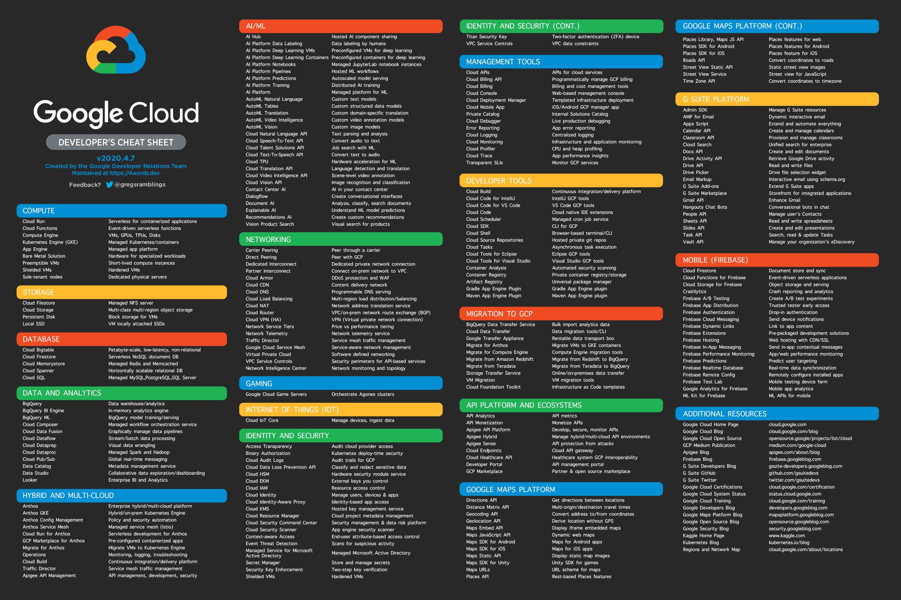
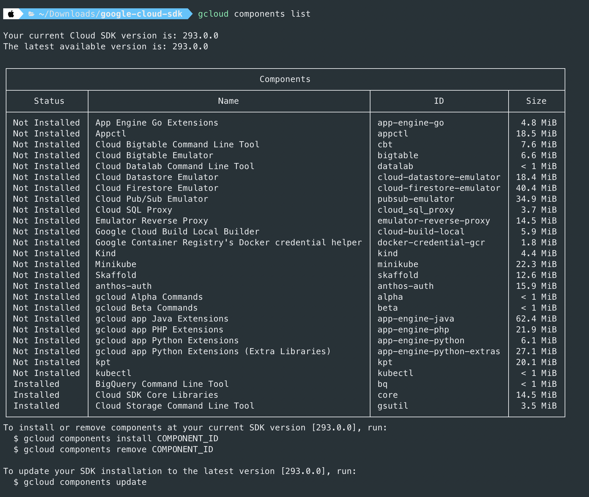

# ACE Cheat Sheet
## The Google Cloud Developer Cheat Sheet
<a target="_blank" href="gcpdev.png"></a>

[Exam & Certification Info](https://cloud.google.com/certification/cloud-engineer)

[Practice Exam](https://cloud.google.com/certification/practice-exam/cloud-engineer)

[Exam Notes](https://docs.google.com/document/d/1u6pXBiGMYj7ZLBN21x6jap11rG6gWk7n210hNnUzrkI/edit)

[Udemy Course](https://www.udemy.com/course/google-certified-associate-cloud-engineer/)

## Cloud SDK Commands

[Full Cheatsheet](https://gist.github.com/pydevops/cffbd3c694d599c6ca18342d3625af97)

### List account and project details associated with the current config including current zone
```sh
gcloud config list
```

### List info related to the Cloud SDK
```sh
gcloud info
```


### List all Cloud SDK Components
```sh
gcloud components list
```

### Cloud SDK Components

<a target="_blank" href="components.png"></a>

### List all gcloud configurations

```sh
gcloud config configurations list
```

### Config Set Zone

```sh
gcloud config set compute/zone us-east-1
```

### Config Unset Zone

```sh
gcloud config unset compute/zone
```


